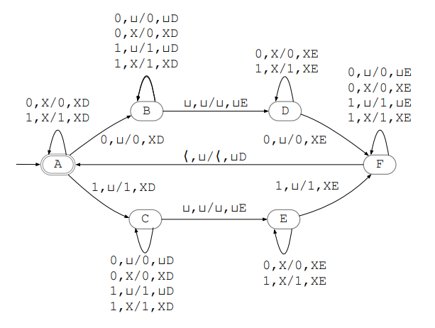

# Turing Machine

Turing Machine of Multiple trails made for Formal Languages and Automata Subject at college.

## How to Run

> python ./mt.py ./mt.json "word"

Replace `"word"` with the input word you want to test on the Turing Machine.

## Contributors

This project was built in partnership with Ivia Costa.

## Configuration File (mt.json)

The `mt.json` file contains the configuration for the Turing Machine. It defines the number of trails, transitions, states, and alphabet used by the machine. If you want, you can design your own Turing Machine .json file and replace it.

For example, you can use mt_2.json, which refers to a Machine L = { wwR | w ∈ {0,1} } . As shown in the picture:

## License

This project is licensed under the [MIT License](LICENSE). Feel free to use and modify the code as per the terms of the license.

Thank you for using the Turing Machine! We hope it helps you better understand Formal Languages and Automata.
